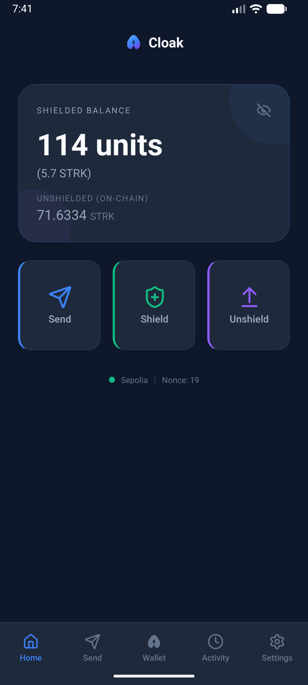
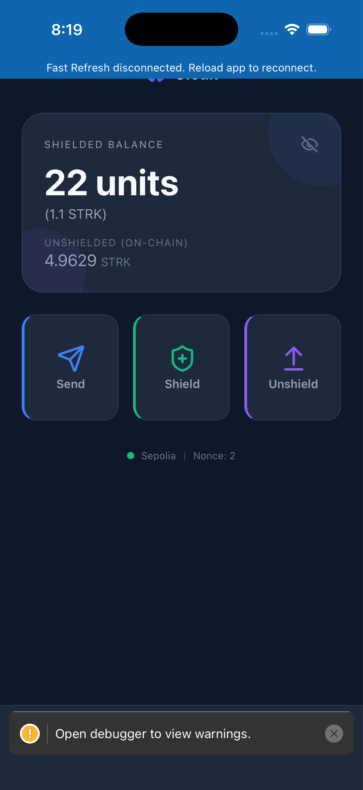
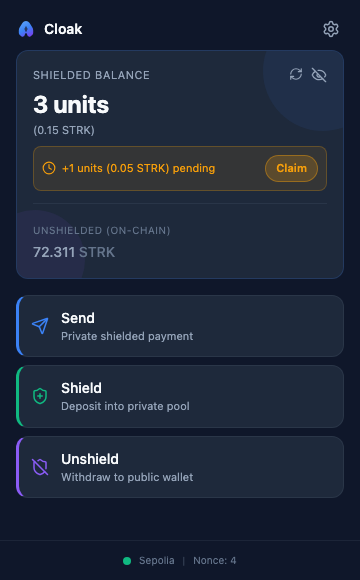
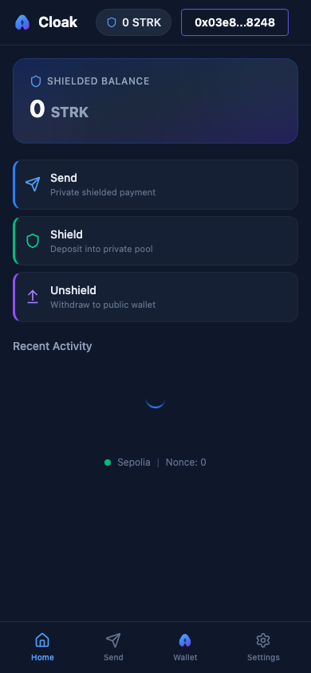
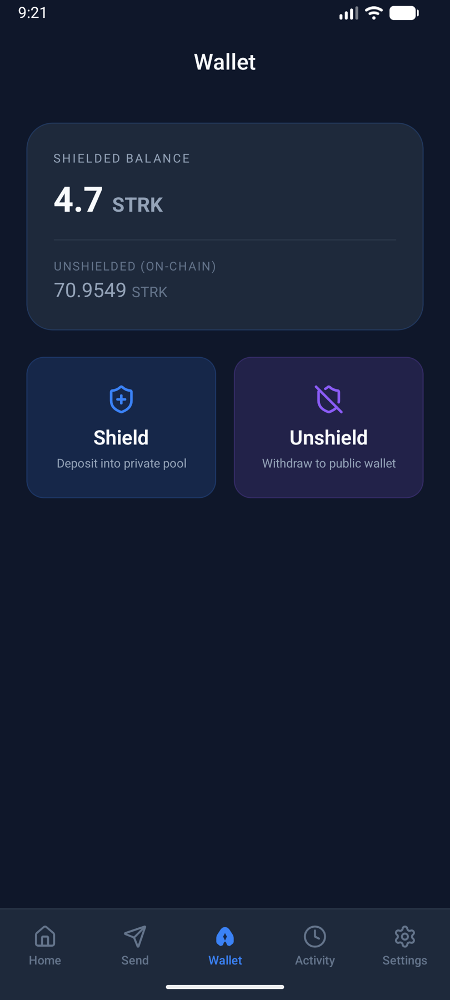
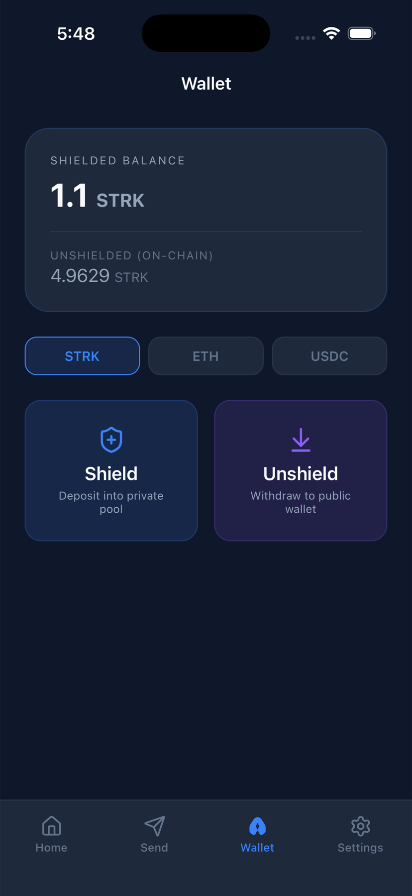
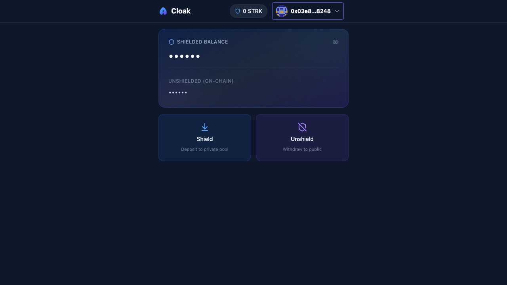
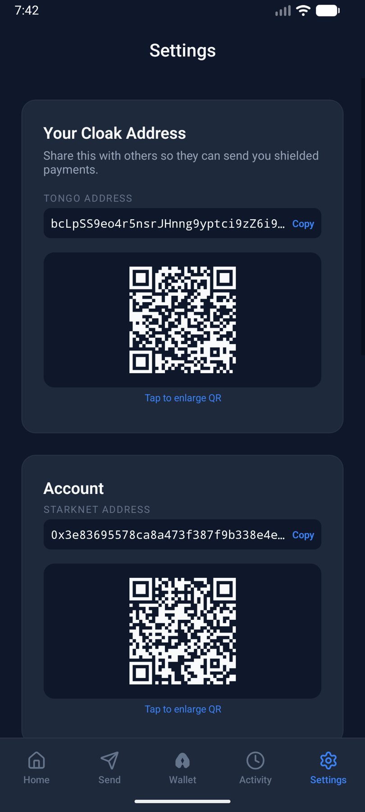
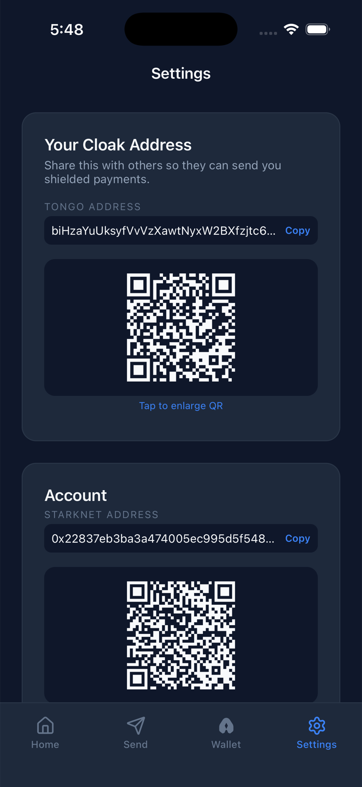
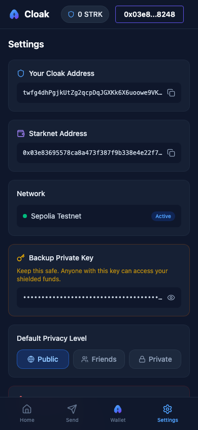

# Cloak

**Private payments on Starknet. Social by design, cryptographically hidden.**

Cloak is a privacy wallet that works like Venmo — send payments to friends with notes, see a social feed of who paid whom — but amounts are **always encrypted on-chain** using ElGamal encryption and zero-knowledge proofs via [Tongo](https://www.npmjs.com/package/@fatsolutions/tongo-sdk).

Available as a **web app**, **Chrome extension**, and **mobile app** (Android + iOS), all with a unified UI.

---

## Screenshots

<table>
  <tr>
    <td align="center"><strong>Android</strong></td>
    <td align="center"><strong>iOS</strong></td>
    <td align="center"><strong>Chrome Extension</strong></td>
    <td align="center"><strong>Web App</strong></td>
  </tr>
  <tr>
    <td></td>
    <td></td>
    <td></td>
    <td></td>
  </tr>
</table>

<details>
<summary>More screenshots</summary>

**Wallet**
<table>
  <tr>
    <td align="center">Android</td>
    <td align="center">iOS</td>
    <td align="center">Web</td>
  </tr>
  <tr>
    <td></td>
    <td></td>
    <td></td>
  </tr>
</table>

**Settings**
<table>
  <tr>
    <td align="center">Android</td>
    <td align="center">iOS</td>
    <td align="center">Web</td>
  </tr>
  <tr>
    <td></td>
    <td></td>
    <td></td>
  </tr>
</table>

</details>

---

## How It Works

```
Public Wallet (STRK)
       |
  [ Shield ] ──── ElGamal Encryption ────> Encrypted Balance (on-chain)
                                                    |
  [ Unshield ] <──── ZK Proof ──── [ Shielded Transfer ]
       |                            (amount hidden, note visible)
       v
  Public Wallet
```

1. **Shield** — Deposit STRK from your public wallet into an encrypted private pool
2. **Send** — Transfer any amount to another Cloak address; only sender and receiver can see the amount
3. **Claim** — Roll incoming pending transfers into your spendable balance
4. **Unshield** — Withdraw back to your public wallet with a ZK proof

---

## Platforms

### Web App

Next.js 15 frontend with wallet connect (ArgentX / Braavos). Social feed shows transaction notes but never amounts.

```bash
yarn install && yarn start    # http://localhost:3000
```

### Chrome Extension

Standalone wallet — manages its own Starknet keypair, no browser wallet dependency. Install by loading `packages/extension/dist/` as an unpacked extension.

```bash
yarn workspace @cloak/extension build
```

### Mobile App

React Native with a WebView bridge to the Tongo SDK. Runs on Android and iOS.

```bash
cd packages/mobile && npm install
cd bridge-bundle && npm run build && cd ..
npx react-native run-android   # or run-ios
```

### SDK (`@cloak/sdk`)

Reusable TypeScript library wrapping Tongo for shielded wallet operations.

```typescript
import { CloakClient, MemoryStorage } from "@cloak/sdk";

const client = new CloakClient({ network: "sepolia", storage: new MemoryStorage() });
await client.createWallet();
await client.init();

await client.account("STRK").fund(2n);                          // Shield
await client.account("STRK").transfer("tongoAddress", 1n);      // Send
await client.account("STRK").withdraw(1n);                       // Unshield
```

---

## Tech Stack

| Layer | Technology |
|-------|-----------|
| Chain | Starknet (Sepolia) |
| Privacy | [Tongo SDK](https://www.npmjs.com/package/@fatsolutions/tongo-sdk) — ElGamal encryption + ZK proofs |
| Web | Next.js 15, React 19, Tailwind CSS, Framer Motion |
| Extension | Chrome Manifest V3, React 18, Vite, Tailwind CSS |
| Mobile | React Native 0.83, WebView bridge (Android + iOS) |
| SDK | TypeScript, tsup (CJS + ESM), vitest |
| Wallets | ArgentX, Braavos (web), self-custodial (extension + mobile) |

---

## Getting Started

```bash
git clone https://github.com/Mohiiit/cloak.git
cd cloak
yarn install
yarn start
```

Requires Node.js >= 22 and a Starknet wallet (ArgentX or Braavos) on Sepolia.

---

## Built for Re{define} Hackathon

Privacy Track. Core insight: Venmo already hides amounts from the social feed — Cloak makes this **cryptographic and on-chain**, not a UI choice.

> **Note:** The current build focuses on **STRK** as the sole supported token. Multi-token support (ETH, USDC) is architecturally supported by the Tongo SDK but disabled in the UI to keep the hackathon demo focused and reliable.

## License

Source Available — free for personal, educational, and non-commercial use. Commercial use requires a separate license. See [LICENSE](LICENSE) for details.

Copyright (c) 2026 Mohit Dhattarwal
