# Cloak — Social Shielded Payments on Starknet

> Cloak your payments. Social transactions, cryptographically private.

Cloak is a Venmo-like private payment wallet built on Starknet. Send shielded payments to friends with notes and emojis — the social feed shows who paid whom and why, but **amounts are always hidden** using Tongo's ElGamal encryption and zero-knowledge proofs.

## What it does

- **Shield funds** — Deposit ERC20 tokens (STRK, ETH, USDC) into a private pool
- **Send shielded payments** — Transfer to any Cloak address; amounts are encrypted on-chain
- **Social feed** — Transactions show notes and emojis, never amounts
- **Manage contacts** — Save Cloak addresses for quick payments
- **Claim pending** — Roll over incoming transfers to your balance
- **Unshield** — Withdraw back to your public wallet anytime

## How it works

```
Public Wallet (ERC20)
        │
   ┌────▼────┐      ElGamal Encryption
   │  Shield  │  ──────────────────────►  Encrypted Balance
   └─────────┘                            (on-chain, hidden)
                                               │
                    ZK Proof                    │
   ┌──────────┐  ◄──────────────  ┌────────────▼──────────┐
   │ Unshield │                   │ Shielded Transfer     │
   └────┬─────┘                   │ (amount hidden, note  │
        │                         │  visible in social    │
        ▼                         │  feed)                │
   Public Wallet                  └───────────────────────┘
```

1. **Tongo SDK** handles all encryption, proof generation, and on-chain operations
2. Each user gets a separate Tongo keypair (stored in browser localStorage)
3. Transfers are encrypted with ElGamal — only sender and receiver can decrypt amounts
4. The social feed shows transaction notes/emojis but never amounts

## Screenshots

| Home | Send Payment | Payment Sent |
|:----:|:----:|:------:|
|  |  |  |

| Wallet | Pending Funds | Shield Modal |
|:------:|:--------:|:--------:|
|  |  |  |

| Contacts | Settings |
|:--------:|:--------:|
|  |  |

## How to Use

### 1. Connect Your Wallet

Install [ArgentX](https://www.argent.xyz/) or [Braavos](https://braavos.app/) and switch to **Starknet Sepolia**. Click **Connect Wallet** on the home page. On first connect, Cloak generates your private Tongo keypair automatically — this is your Cloak identity.


### 2. Shield Funds

Go to the **Wallet** tab. Tap **Shield** to deposit ERC20 tokens (STRK, ETH, or USDC) from your public wallet into your shielded balance. Enter the amount and confirm the transaction.

| Wallet | Shield Modal |
|:------:|:------------:|
|  |  |

Once confirmed, your shielded balance updates — the amount is now encrypted on-chain.

### 3. Send a Shielded Payment

Go to the **Send** tab. The 3-step wizard walks you through:

1. **To** — Enter the recipient's Cloak address (base58) or pick from contacts
2. **Amount** — Choose how much to send from your shielded balance
3. **Confirm** — Add a note and emoji, then review and send

| Confirm Payment | Payment Sent |
|:---------------:|:------------:|
|  |  |

The transaction note and emoji appear in the social feed, but the **amount is never revealed** — it's encrypted with ElGamal so only sender and receiver can see it.

### 4. Claim Pending Funds

When someone sends you a shielded payment, it appears as **Pending** in your Wallet. Tap **Claim** to roll the pending amount into your spendable shielded balance.


### 5. Manage Contacts

Save frequently used Cloak addresses in the **Contacts** tab for quick payments. Share your own Cloak address with friends so they can send to you.


### 6. Backup Your Key

Go to **Settings** to copy your Cloak address or back up your Tongo private key. Keep this key safe — it's the only way to decrypt your shielded balance.


### 7. Unshield

When you want to move funds back to your public wallet, go to **Wallet** and tap **Unshield**. This generates a ZK proof and withdraws the specified amount to your connected Starknet address.

## Mobile App

Native mobile wallet (Android + iOS) built with React Native + WebView bridge to Tongo SDK.

| Home | Wallet | Themed Modal |
|:----:|:------:|:------------:|
| 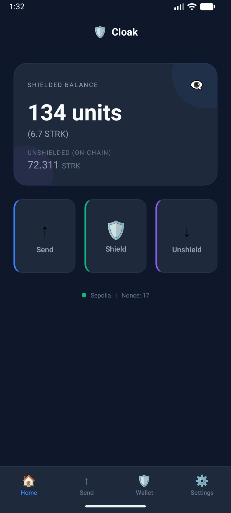 | 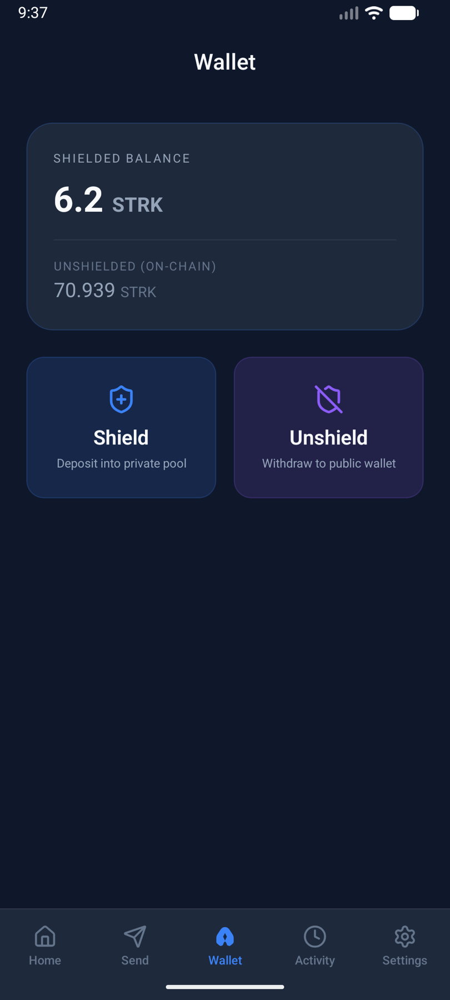 | 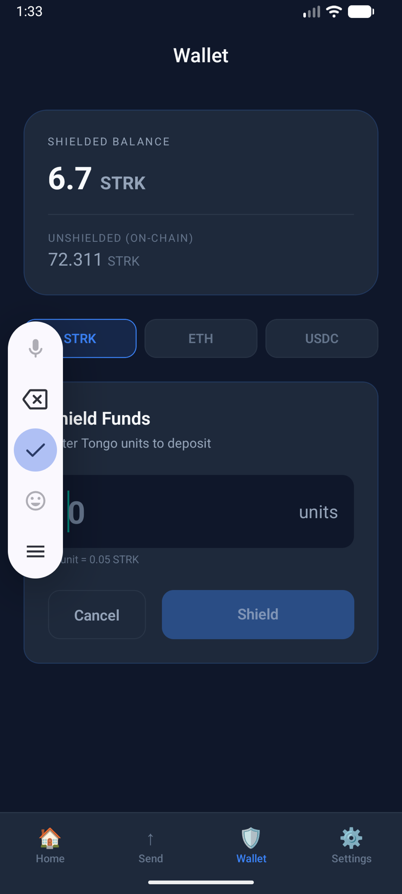 |

| Send Payment | Settings |
|:------------:|:--------:|
| 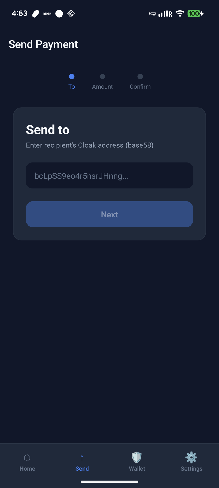 | 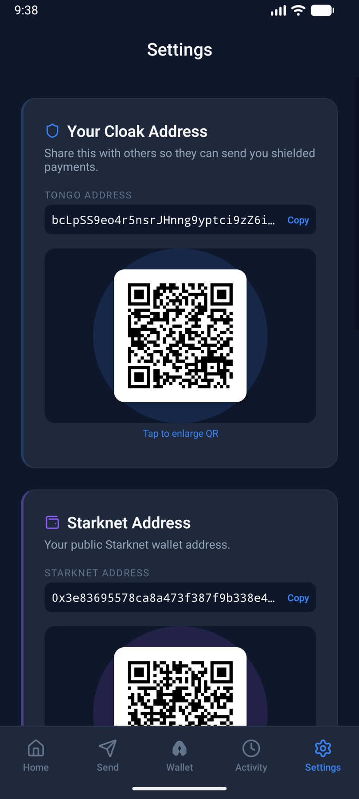 |

**Features:**
- Dual balance display — shielded (Tongo) + unshielded (on-chain ERC20)
- Themed dark modals for all confirmations and alerts
- Claim banner for pending funds with loading state
- Token switching (STRK/ETH/USDC) with live on-chain balance
- Full shield/transfer/claim/unshield flow verified on Sepolia (cross-device)

### Run Mobile App

```bash
cd packages/mobile
npm install
cd bridge-bundle && npm run build && cd ..

# Android
npx react-native run-android

# iOS
cd ios && pod install && cd ..
npx react-native run-ios
```

## SDK (`@cloak/sdk`)

Reusable TypeScript library that wraps the Tongo SDK for privacy-preserving wallet operations on Starknet.

```typescript
import { CloakClient, MemoryStorage } from "@cloak/sdk";

const client = new CloakClient({ network: "sepolia", storage: new MemoryStorage() });
const wallet = await client.createWallet();
await client.init();

// Shield 2 STRK (in Tongo units)
const { txHash } = await client.account("STRK").fund(2n);

// Private transfer
await client.account("STRK").transfer("recipientTongoAddress", 1n);

// Unshield
await client.account("STRK").withdraw(1n);
```

```bash
yarn workspace @cloak/sdk build   # Build CJS + ESM + types
yarn workspace @cloak/sdk test    # Run unit tests (28 passing)
```

## Chrome Extension

Standalone privacy wallet as a Chrome extension — manages its own Starknet keypair and signs transactions directly (no ArgentX/Braavos dependency).

**Install:** Load `packages/extension/dist/` as an unpacked extension in `chrome://extensions`.

```bash
yarn workspace @cloak/extension build   # Build extension
```

| Onboarding | Deploy | Dashboard |
|:----------:|:------:|:---------:|
| 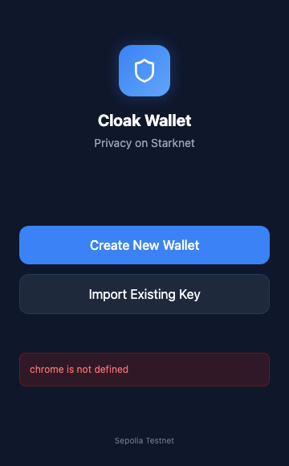 | 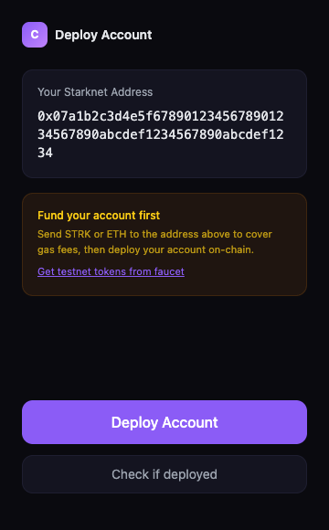 |  |

| Shield | Send | Receive | Settings |
|:------:|:----:|:-------:|:--------:|
| 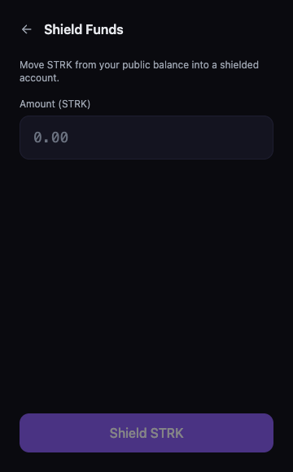 | 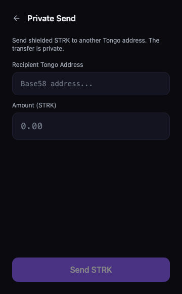 | 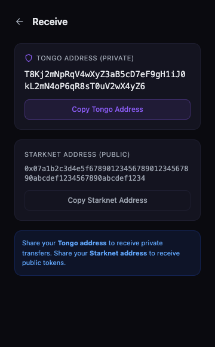 | 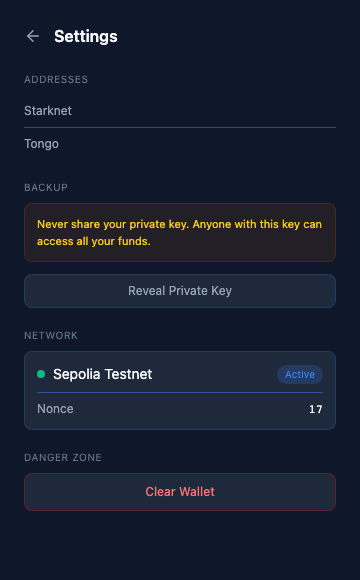 |

## Tech Stack

| Layer | Technology |
|-------|-----------|
| Chain | Starknet Sepolia |
| Privacy | [Tongo SDK](https://www.npmjs.com/package/@fatsolutions/tongo-sdk) (ElGamal + ZK proofs) |
| Frontend | Next.js 15, React 19, TypeScript |
| Scaffold | [Scaffold-Stark 2](https://scaffoldstark.com/) |
| Styling | Tailwind CSS 4, DaisyUI 5 |
| Animation | Framer Motion |
| Identity | starknetid.js |
| Wallets | ArgentX, Braavos |
| Mobile | React Native 0.83, WebView bridge (Android + iOS) |
| SDK | `@cloak/sdk` — TypeScript, tsup (CJS + ESM), vitest |
| Extension | Chrome Manifest V3, React 18, Vite, Tailwind CSS |

## Getting Started

### Prerequisites

- Node.js >= v22
- Yarn (v3, included in repo)
- ArgentX or Braavos wallet extension

### Setup

```bash
git clone https://github.com/Mohiiit/cloak.git
cd cloak
yarn install
```

### Run

```bash
yarn start
```

Open [http://localhost:3000](http://localhost:3000)

### Environment

The `.env` is auto-created from `.env.example` with a Sepolia RPC URL.

## Sepolia Token Contracts

| Token | Tongo Contract |
|-------|---------------|
| STRK | `0x0408163bfcfc2d76f34b444cb55e09dace5905cf84c0884e4637c2c0f06ab6ed` |
| ETH | `0x02cf0dc1d9e8c7731353dd15e6f2f22140120ef2d27116b982fa4fed87f6fef5` |
| USDC | `0x02caae365e67921979a4e5c16dd70eaa5776cfc6a9592bcb903d91933aaf2552` |

## Built for Re{define} Hackathon

Cloak was built for the Re{define} Hackathon Privacy Track. Core insight: Venmo already hides amounts from the social feed — Cloak makes this cryptographic and on-chain using Tongo's ElGamal encryption, rather than a UI choice.

## License

MIT
