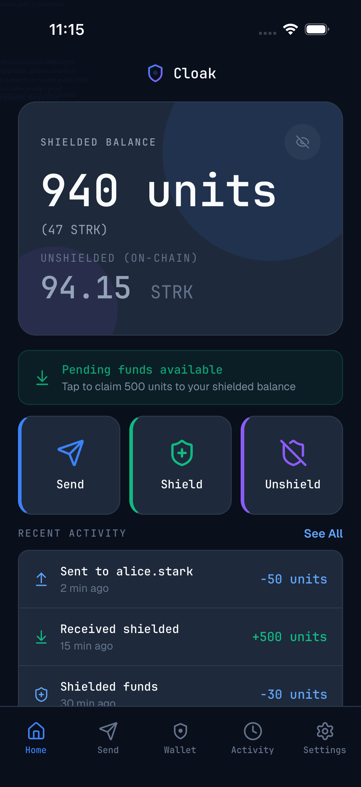
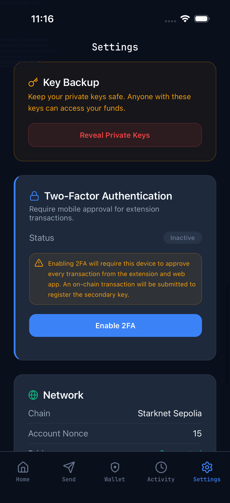

# Cloak Mobile E2E

This folder contains deterministic mobile testing assets for Android and iOS.

## Stack

- Maestro for user-journey automation.
- RNTL/Jest for local deterministic unit/integration checks.
- Hybrid runtime strategy:
  - `e2e-mock` (primary CI gate, deterministic)
  - `e2e-live` (nightly smoke against live Sepolia dependencies)

## Layout

- `maestro/config.yaml`: profile map for Android/iOS mock/live entries.
- `maestro/flows/shared`: reusable subflows.
- `maestro/flows/setup`: setup and onboarding/deploy/bootstrap flows.
- `maestro/flows/core`: platform matrix entrypoints + core scenarios.
- `maestro/flows/ward`: guardian/ward approval scenarios.
- `maestro/flows/twofa`: ward and guardian 2FA scenario matrix.
- `maestro/flows/regressions`: resilience and retry regressions.
- `maestro/flows/dual`: sticky-role suites (iOS guardian, Android ward) without role resets.
- `artifacts/<run-id>/<platform>/...`: screenshots, logs, junit output.

## Run Commands

From repo root:

```bash
yarn mobile:test:unit
yarn mobile:test:e2e:android:mock
yarn mobile:test:e2e:android:basic-live-deploy
yarn mobile:test:e2e:ios:mock
yarn mobile:test:e2e:dual-role:mock
yarn mobile:test:e2e:dual-role:live
yarn mobile:test:e2e:dual-role:matrix:live
yarn mobile:test:e2e:live-smoke
yarn mobile:test:all:mock
```

From `packages/mobile`:

```bash
yarn test:unit
yarn test:e2e:android:mock
yarn test:e2e:android:basic-live-deploy
yarn test:e2e:ios:mock
yarn test:e2e:dual-role:mock
yarn test:e2e:dual-role:live
yarn test:e2e:dual-role:matrix:live
yarn test:e2e:live-smoke
yarn test:all:mock
```

## Dual-Role Sticky Mode (iOS Guardian + Android Ward)

Use this when you want to keep role state stable across runs and avoid delete/re-import loops.

Default stage order:

1. iOS guardian actions (`ios-guardian-sticky`)
2. Android ward actions (`android-ward-sticky`)
3. iOS guardian approvals (`ios-guardian-approvals-only`)
4. Optional Android ward 2FA stage (`android-ward-twofa-sticky`, enabled with `RUN_WARD_TWOFA=1`)

Command:

```bash
yarn workspace CloakMobile test:e2e:dual-role:live
```

Useful overrides:

```bash
RUN_ID=dual-20260215 \
IOS_SKIP_BUILD=1 \
ANDROID_SKIP_BUILD=1 \
IOS_SIMULATOR_NAME="iPhone 16" \
ANDROID_DEVICE=emulator-5554 \
RUN_WARD_TWOFA=1 \
yarn workspace CloakMobile test:e2e:dual-role:live
```

Preconditions:

- iOS device should already be in guardian context (wallet exists, deployed, funded as needed).
- Android device should already be in ward context.
- For true guardian/ward interaction signal across devices, use `e2e-live` (shared backend).
- `e2e-mock` dual-role mode is useful for UI stability checks but does not provide shared cross-device backend state.

## Dual-Role Matrix (Live)

For the full matrix requested during debugging (guardian setup + ward setup + accept/reject branches):

```bash
yarn workspace CloakMobile test:e2e:dual-role:matrix:live
```

This script performs:

1. iOS guardian setup from scratch: create wallet -> copy deploy address -> fund via script -> deploy -> create ward -> copy ward invite JSON.
2. Android ward setup from scratch: import ward invite JSON -> ensure ward home.
3. Case matrix:
   - guardian transfer + ward claim + guardian approve/reject
   - ward 2FA enabled: ward-stage reject, then ward-approve + guardian reject/approve
   - ward 2FA + guardian 2FA enabled: ward-approve + guardian reject/approve

Required env vars:

- `FUNDER_ADDRESS`
- `FUNDER_PRIVATE_KEY`

Optional:

- `FUND_AMOUNT` (default `1.0`)
- `STARKNET_RPC_URL` (default `https://rpc.starknet-testnet.lava.build`)
- `IOS_SIMULATOR_NAME` (default `iPhone 17 Pro`)
- `ANDROID_DEVICE` (default `emulator-5554`)

## Artifacts

Each runner writes to:

- `packages/mobile/e2e/artifacts/<run-id>/android`
- `packages/mobile/e2e/artifacts/<run-id>/ios`

The scripts capture:

- `maestro.log`
- `maestro-junit.xml`
- build/install logs (`gradle.log`, `xcodebuild.log`, `simctl-install.log`)
- debug artifacts where supported by installed Maestro (`debug/`)

## Runtime Modes

- `prod`: default app behavior.
- `e2e-mock`: deterministic suite with mock bridge/approval backends.
- `e2e-live`: integration smoke suite.

## Live Deploy Prereqs (Android Basic Flow)

For `test:e2e:android:basic-live-deploy`, provide:

- `FUNDER_ADDRESS`: funded Starknet Sepolia account
- `FUNDER_PRIVATE_KEY`: private key for that account

Optional:

- `FUND_AMOUNT` (default `0.8` STRK)
- `STARKNET_RPC_URL` (default `https://rpc.starknet-testnet.lava.build`)

## CI Gate Policy

- Required on PRs: `mobile:test:unit` + Android/iOS mock matrix suites.
- Non-blocking: nightly live smoke jobs.

## Screen Parity Snapshots

Captured after successful simulator run and manual sanity check.
These screenshots intentionally exclude private keys and secret material.

### 2026-02-17

- `Cloak - Dashboard` (`7Vrpd`) parity run:
  - `packages/mobile/e2e/screenshots/2026-02-17/ios-dashboard-7Vrpd.png`



- `Settings -> Network` verification (home removed nonce/chain, settings contains nonce/chain):
  - `packages/mobile/e2e/screenshots/2026-02-17/ios-settings-network.png`



## Parity Tracker

| Step | Frame | Screen/Modal | Files Updated | Commit | iOS Screenshot | Android Screenshot | Extension Screenshot | Sensitive Check |
|---|---|---|---|---|---|---|---|---|
| 01 | `7iu2u` | Onboarding (Home no-wallet state) | `packages/mobile/src/screens/HomeScreen.tsx` | `a6870c7` | `packages/mobile/e2e/screenshots/2026-02-17/01-7iu2u-ios.png` | pending | n/a | passed |
| 02 | `Gyt7Z` | Deploy Account | `packages/mobile/src/screens/DeployScreen.tsx` | `4945647` | `packages/mobile/e2e/screenshots/2026-02-17/02-Gyt7Z-ios.png` | pending | n/a | passed |
| 03 | `7Vrpd` | Dashboard (non-ward) | `packages/mobile/src/screens/HomeScreen.tsx` | `562b3eb` | `packages/mobile/e2e/screenshots/2026-02-17/03-7Vrpd-ios.png` | pending | n/a | passed |
| 04 | `Sap4z` | Ward Dashboard (frozen) | `packages/mobile/src/screens/HomeScreen.tsx`, `packages/mobile/src/navigation/AppNavigator.tsx` | `8a38601` | `packages/mobile/e2e/screenshots/2026-02-17/04-Sap4z-ios.png` | pending | n/a | passed |
| 05 | `Grp6y` | Send (default) | `packages/mobile/src/screens/SendScreen.tsx`, `packages/mobile/src/navigation/AppNavigator.tsx` | `da66385` | `packages/mobile/e2e/screenshots/2026-02-17/05-Grp6y-ios.png` | pending | n/a | passed |
| 06 | `CUfLL` | Send (keyboard) | `packages/mobile/src/screens/SendScreen.tsx`, `packages/mobile/src/components/KeyboardSafeContainer.tsx` | `db522d9` | `packages/mobile/e2e/screenshots/2026-02-17/06-CUfLL-ios.png` | pending | n/a | passed |
| 07 | `O3kob` | Wallet (default) | `packages/mobile/src/screens/WalletScreen.tsx`, `packages/mobile/src/testing/testIDs.ts` | `f007a8d` | `packages/mobile/e2e/screenshots/2026-02-17/07-O3kob-ios.png` | pending | n/a | passed |
| 08 | `UhCeU` | Wallet (shield keyboard) | `packages/mobile/src/screens/WalletScreen.tsx` | `12eb3ce` | `packages/mobile/e2e/screenshots/2026-02-17/08-UhCeU-ios.png` | pending | n/a | passed |
| 09 | `FEfix` | Wallet (unshield keyboard) | `packages/mobile/src/screens/WalletScreen.tsx` | `5410515` | `packages/mobile/e2e/screenshots/2026-02-17/09-FEfix-ios.png` | pending | n/a | passed |
| 10 | `09FBd` | Activity | `packages/mobile/src/screens/ActivityScreen.tsx` | `2a8c0dc` | `packages/mobile/e2e/screenshots/2026-02-17/10-09FBd-ios.png` | pending | n/a | passed |
| 11 | `XzS0q` | Transaction Detail | `packages/mobile/src/screens/activity/TransactionDetailScreen.tsx`, `packages/mobile/src/navigation/RootNavigator.tsx` | `ecca20d` | `packages/mobile/e2e/screenshots/2026-02-17/11-XzS0q-ios.png` | pending | n/a | passed |
